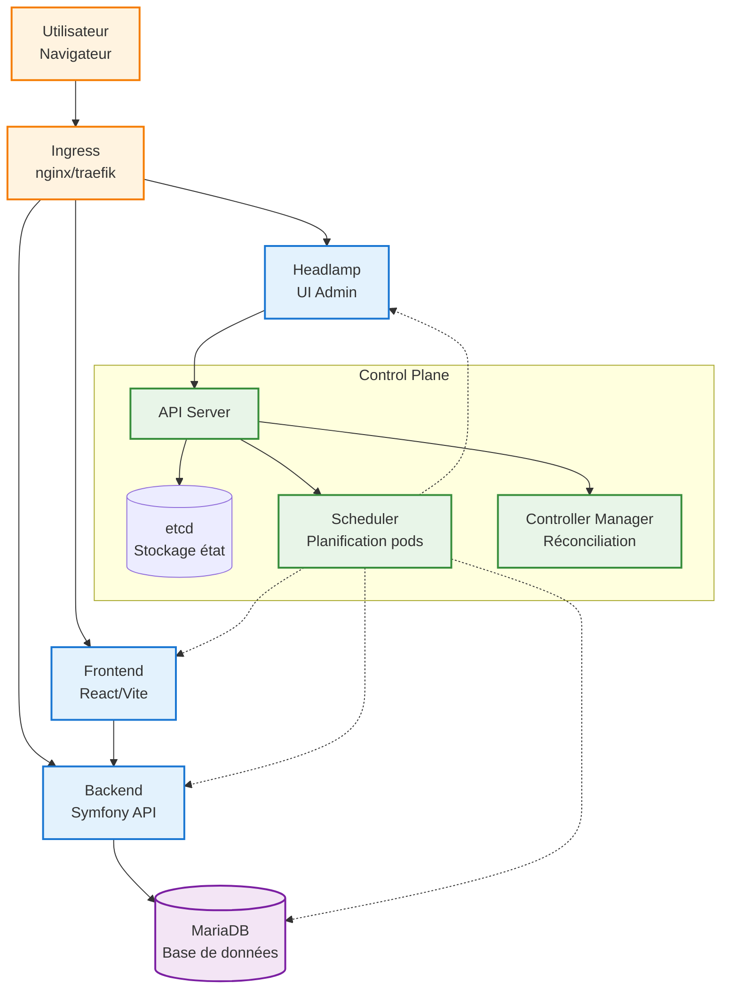
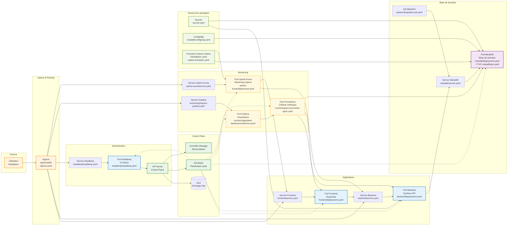

# Kubernetes architecture détaillée (PokemonDocker)

## Objectif
Ce diagramme Mermaid décrit toute l’infrastructure Kubernetes du projet : cluster, namespace, pods, services, ingress, rôles et principaux flux réseau.
Le but est qu’un lecteur qui découvre le projet comprenne le système sans autre documentation.

---

## Légende
- 🟦 Control Plane (API Server / etcd / Scheduler / Controller Manager)
- 🟩 Accès externe (Ingress, navigateur)
- 🟨 Applications (frontend, backend, DB)
- 🟪 Admin & monitoring (Headlamp)
- 🟥 IAM / RBAC (ServiceAccount / ClusterRoleBinding)

---

## Diagramme Mermaid simplifié

---

## Diagramme Mermaid détaillé

Ce diagramme inclut tous les pods, déploiements, services, ingress, et composants de monitoring présents dans le projet (basé sur les fichiers YAML dans `k8s/`).

---

## Déroulé et explications détaillées
- **Pods et Déploiements** : Chaque application est déployée via des pods (conteneurs orchestrés par Kubernetes). Par exemple, le Backend a un déploiement avec des pods Symfony, le Frontend avec React/Vite.
- **Services** : Exposent les pods à l'intérieur du cluster (par exemple, le service Backend permet au Frontend de l'appeler).
- **Ingress** : Route le trafic externe vers les services appropriés.
- **Monitoring** : Prometheus collecte des métriques des pods, Grafana les visualise, Uptime-Kuma vérifie la disponibilité.
- **Job** : Le Migration Job exécute des migrations de base de données au démarrage.
- **Ressources partagées** : Secrets pour les mots de passe, ConfigMap pour les configs, PVC pour le stockage persistant.
- **Control Plane** : Gère l'orchestration de tous les pods.

Les flèches montrent les connexions réseau, les dépendances et les interactions (par exemple, Prometheus collecte depuis les pods).
- **Utilisateur** : Accès via navigateur web
- **Ingress** : Point d'entrée du trafic externe, redirige vers les applications
- **Frontend** : Interface utilisateur React/Vite
- **Backend** : API Symfony qui traite les requêtes
- **MariaDB** : Base de données pour stocker les données
- **Headlamp** : Interface d'administration Kubernetes
- **Control Plane** : Cœur de Kubernetes (API Server, etcd, Scheduler, Controller Manager)

Les flèches montrent les connexions réseau et les dépendances entre composants.

---

## Commandes de vérification
- `kubectl get pods -n pokemon -o wide`
- `kubectl get svc -n pokemon`
- `kubectl describe ingress -n pokemon`
- `kubectl describe deployment headlamp -n pokemon`
- `kubectl logs -n pokemon -l app=headlamp --tail=50`
- `kubectl rollout status deployment/headlamp -n pokemon`
