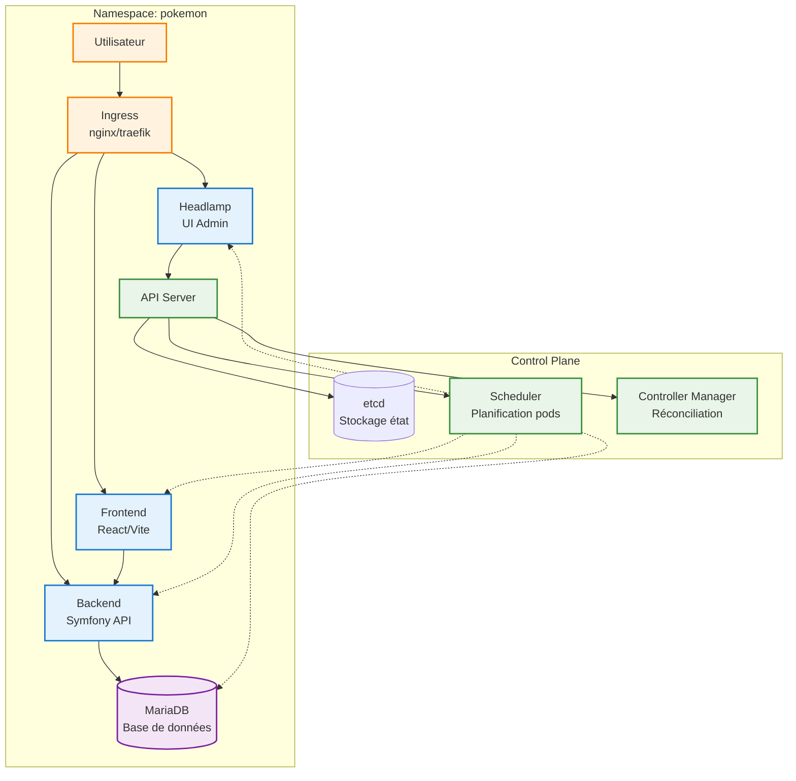

# Kubernetes architecture détaillée (PokemonDocker)

## Objectif
Ce diagramme Mermaid décrit toute l’infrastructure Kubernetes du projet : cluster, namespace, pods, services, ingress, rôles et principaux flux réseau.
Le but est qu’un lecteur qui découvre le projet comprenne le système sans autre documentation.

---

## Légende
- 🟦 Control Plane (API Server / etcd / Scheduler / Controller Manager)
- 🟩 Accès externe (Ingress, navigateur)
- 🟨 Applications (frontend, backend, DB)
- 🟪 Admin & monitoring (Headlamp)
- 🟥 IAM / RBAC (ServiceAccount / ClusterRoleBinding)

---

## Diagramme Mermaid simplifié

---

## Déroulé et explications
- **Utilisateur** : Accès via navigateur web
- **Ingress** : Point d'entrée du trafic externe, redirige vers les applications
- **Frontend** : Interface utilisateur React/Vite
- **Backend** : API Symfony qui traite les requêtes
- **MariaDB** : Base de données pour stocker les données
- **Headlamp** : Interface d'administration Kubernetes
- **Control Plane** : Cœur de Kubernetes (API Server, etcd, Scheduler, Controller Manager)

Les flèches montrent les connexions réseau et les dépendances entre composants.

---

## Commandes de vérification
- `kubectl get pods -n pokemon -o wide`
- `kubectl get svc -n pokemon`
- `kubectl describe ingress -n pokemon`
- `kubectl describe deployment headlamp -n pokemon`
- `kubectl logs -n pokemon -l app=headlamp --tail=50`
- `kubectl rollout status deployment/headlamp -n pokemon`
